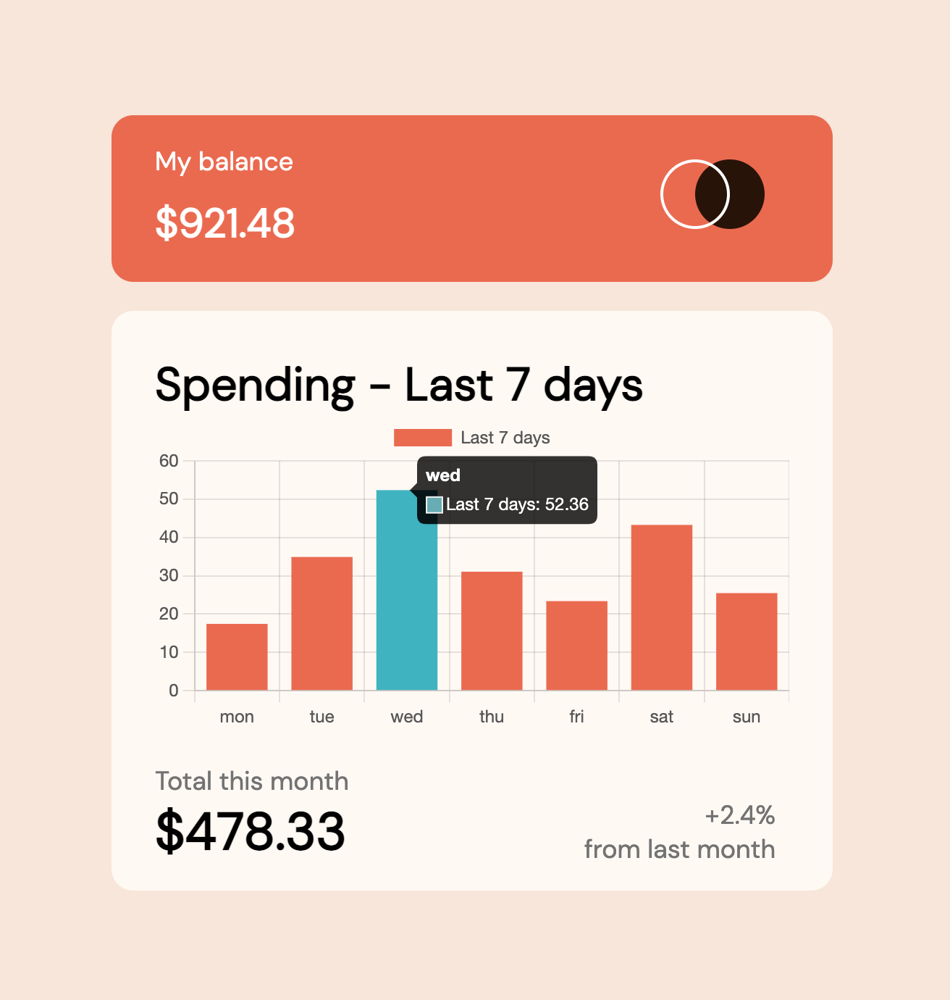
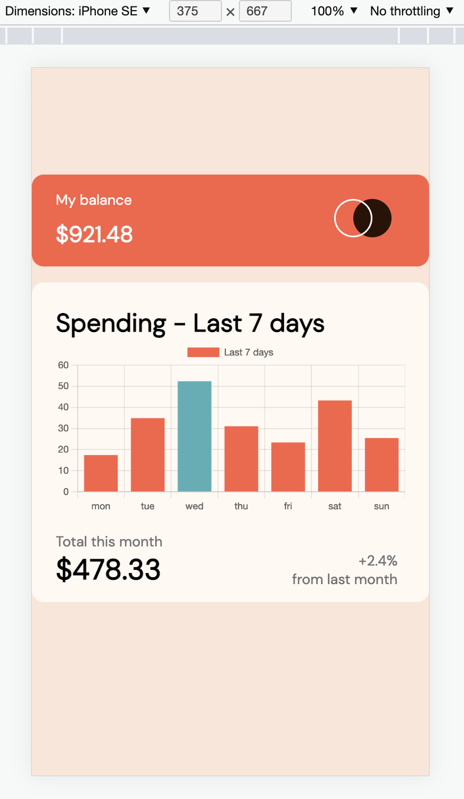

# Frontend Mentor - Expenses chart component solution

This is a solution to the [Expenses chart component challenge on Frontend Mentor](https://www.frontendmentor.io/challenges/expenses-chart-component-e7yJBUdjwt). Frontend Mentor challenges help you improve your coding skills by building realistic projects.

## Overview

### The challenge

Users should be able to:

- View the bar chart and hover over the individual bars to see the correct amounts for each day
- See the current day’s bar highlighted in a different colour to the other bars
- View the optimal layout for the content depending on their device’s screen size
- See hover states for all interactive elements on the page
- **Bonus**: Use the JSON data file provided to dynamically size the bars on the chart

### Screenshot




## My process

### Built with

- Semantic HTML5 markup
- CSS custom properties
- CSS Grid
- Mobile-first workflow
- [React](https://reactjs.org/) - JS library

### What I learned

Learned about React Charts and how to implement it to the project. Have been struggling with makeing it work, the problem was in importing { Chart as ChartJs } from "chart.js/auto";

Used mapping to enter data from the data file that was provided. Wll be possible to change this to API.
Used Reduce to check for the maximum number from the chart and dynamically making it different color.

Proud of this function:

```js
function getBgColors() {
  const maxSum = chartData.reduce(
    (acc, shot) => (acc = acc > shot.amount ? acc : shot.amount),
    0
  );
  const color = chartData.map((num) =>
    num.amount === maxSum ? "hsl(186, 34%, 60%)" : "hsl(10, 79%, 65%)"
  );
  return color;
}
```

If you want more help with writing markdown, we'd recommend checking out [The Markdown Guide](https://www.markdownguide.org/) to learn more.

**Note: Delete this note and the content within this section and replace with your own learnings.**

### Continued development

### Useful resources

- [Chart JS](https://www.chartjs.org/docs/latest/) - This helped me with setting up Chart JS
- [Grid Examples](https://gridbyexample.com/examples/) - This helped me with understanding better grid system in css

## Author

- LinkedIn - [Marc](https://www.linkedin.com/in/marc-lupanciuc-7424b5113/)
- Frontend Mentor - [@marclupanc](https://www.frontendmentor.io/profile/marclupanc)
- Facebook - [@marclupanc](https://www.facebook.com/mlupanciuc/)
